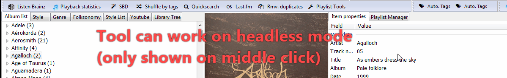
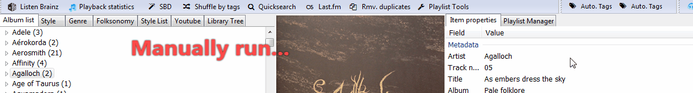

# AutoBackup

[Download :material-download:](https://github.com/regorxxx/AutoBackup-SMP){ .md-button }

## Overview

A [Spider Monkey Panel](https://theqwertiest.github.io/foo_spider_monkey_panel) Script, for [foobar2000](https://www.foobar2000.org), 
which allows periodic automatic saving of configuration and other data in foobar2000 and keeping backup copies of such data. 
Replacement of [foo_jesus](https://www.foobar2000.org/components/view/foo_jesus).

### Features
- Saves configuration ("File\Save Configuration"):
	- Whole configuration subfolder.
	- Media library database (database.-).
	- Playlists.
	- Additional data managed by other components (for example current theme or playback statistics).
- After saving, a backup of the changed files is created, as a ZIP archive (using 7zip).
- Rules to periodically save and backup can be set:
	- While playing (every X min, 0 = off).
	- When playback stops (every X min, 0 = off).
	- Always, since last autosave (every X min, 0 = off).
	- On startup, after X minutes (backup only, 0 = off).
	- Every X tracks (0 = off).
	- On foobar2000 exit (script unload), after X seconds (0 = off).
- Files and folders to backup can be set by name and mask (for example 'js_data\\playlistManager_-').
- Output Zip archive path and name is configurable.
- Backups to keep can be set by number and/or total file size.
- Headless mode: tool button may be invisible but working on background.

### Buttons bar
The button can be loaded within a toolbar or as an independent button. 
It's fully compatible with my other scripts which also use a toolbar (see at bottom), 
so the button can be simply merged with your already existing toolbar panel easily.

!!! question
	Compatible with (toolbar):  
	- [Device Priority](../../scripts/device-priority-smp): Automates foobar2000's output devices.  
    - [Search by Distance](../../scripts/search-by-distance-smp): Creates intelligent "spotify-like"
	playlist using high-level data from tracks and computing their similarity using genres/styles.  
    - [Playlist Tools](../../scripts/playlist-tools-smp): Offers different pre-defefined examples for 
	intelligent playlist creation.  
	- [ListenBrainz](../../scripts/listenbrainz-smp): Integrates Listenbrainz's feedback and recommendations.  
	- [Last.fm](../../scripts/lastfm-smp): Integrates Last.fm playlists, recommendations, ...  