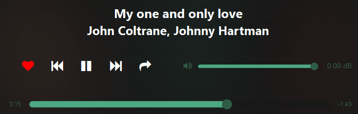

# Infinity-Tools-SMP

[Download :material-download:](https://github.com/regorxxx/Infinity-Tools-SMP){ .md-button }

## Overview

A collection of [Spider Monkey Panel](https://theqwertiest.github.io/foo_spider_monkey_panel)/
[JSplitter](https://foobar2000.ru/forum/viewtopic.php?t=6378) Tools for [foobar2000](https://www.foobar2000.org): 
playback controls, removing duplicates, wrapped, statistics report, advanced playlist manipulation, dynamic queries, 
genre analysis, "spotify-like" playlist creation, ... Infinite possibilities. Previous users of my scripts will notice
 this is a merge of all the previous toolbar scripts, for simplicity, into a new package format.

!!! note
	To use this plugin at its best and to benefit the most from your library, you will want to make sure
	that your songs have the most possible information: genre, style, key, moods, etc. and a cohesive tagging applied to all files.

### Features
- Macros: record and save menus entries used, as a macro, to be called later.
- AutoBackup: periodic configuration backups. [foo_jesus](https://www.foobar2000.org/components/view/foo_jesus) replacement, compatible with foobar2000 v2+ and x64.
- Wrapped: create a report of your listening habits, like Spotify does, with configurable time ranges. Ready to be shared.
- Checksum tools: batch checksum verification and creation for files on your library, to easily handle backups and files integrity.
- Music Map: advanced [offline music similarity recommendation service](https://github.com/regorxxx/Music-Graph) based on genre similarity and not "popularity".
- Dynamic Queries: queries which adapt to the currently selected track. i.e. placeholders tags are substituted with the actual values
 of the currently selected track, then the query is evaluated as usual (like $nowplaying{} from [Library-Tree](https://hydrogenaudio.org/index.php/topic,111060.0.html)).
- Quick-Search & Quick-Match: expanded version of [foo_quicksearch](https://wiki.hydrogenaud.io/index.php?title=Foobar2000:Components/Quicksearch_UI_Element_%28foo_quicksearch%29#Context_menu) 
 which also **works with multiple selections**.
- Pools: playlist creation similar to Random Pools component.  playlists \ library sources (pools) can be set.
- [Harmonic mixing](https://en.wikipedia.org/wiki/Harmonic_mixing): Dj-like selection ordering by key or with special patterns. Compatible with Camelot, Open and Standard keys.
- Fully configurable submenu entries: shift + left click on menu button allows to switch tools functionality.
- User configurable presets: many tools allow you to add your own presets (for ex. Standard Queries) as menu entries.
- Keyboard shortcuts: keyboard shortcuts may be assigned to most of the tools (without requiring panel to be in focus).
- Reduce components loaded with better replacements: Random Pools, Playlist Revive, Best version picker, Database Search, ...
- Online controller integration (ajquery-xxx): online controller fully compatible with most of the offered tools.
- Fully Wine - Unix - non IE SOs compatible.
- Configurable UI and accessibility design: most of the UI is configurable (size, colors, position, draggable buttons).
 All the UI is managed within menus, so it may be used with a narrator (for blindness).

### Buttons bar
The package features a collection of buttons which can be loaded within a toolbar; i.e. you can choose the 
buttons you need and add them to the UI like DUI/CUI toolbars.

