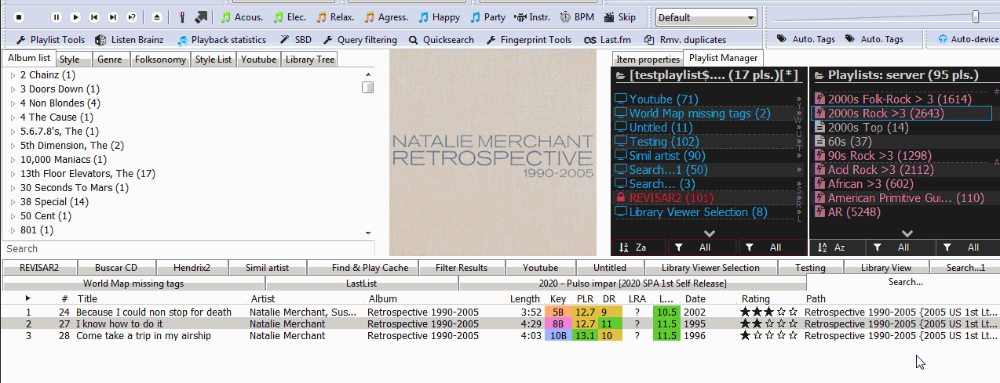

# Last.fm

[Download :material-download:](https://github.com/L3v3L/foo-last-list-smp){ .md-button }

## Overview

An implementation of [Last.fm](https://www.last.fm/) for [foobar2000](https://www.foobar2000.org)
 using [Spider Monkey Panel](https://theqwertiest.github.io/foo_spider_monkey_panel),
 which allows to find matches on library or YouTube from artist's pages, playlists, recommendations,
 stations...

### Features
- Integrates original L3v3L's script into Playlist Tools's toolbar.
- Get top tracks by: Artist, Artist's radio, Similar Artist, Genre, Style, Folksonomy tags, Date, Moods, ...
- Supports multi-values (i.e. if a track has 4 moods, allows to search for each individual value).
- Covers all standard tags: GENRE, STYLE, 'ARTIST GENRE LAST.FM', 'ARTIST GENRE ALLMUSIC', ...
- Create playlist from User's library or loved tracks.
- Matches are retrieved from library and, optionally, from YouTube if plugin is installed.
- Does not require an user token.

### Buttons bar
The button can be loaded within a toolbar or as an independent button. 
It's fully compatible with my other scripts which also use a toolbar (see at bottom), 
so the button can be simply merged with your already existing toolbar panel easily.

### Install as addon
Requires original package to imported within SMP Package manager (no need to be active on a panel). 
Then add a new button as usual from the 'Last.fm' sub-folder.

!!! question
	Compatible with (toolbar):  
	- [Device Priority](../../scripts/device-priority-smp): Automates foobar2000's output devices.  
    - [Search by Distance](../../scripts/search-by-distance-smp): Creates intelligent "spotify-like"
	playlist using high-level data from tracks and computing their similarity using genres/styles.  
    - [Playlist Tools](../../scripts/playlist-tools-smp): Offers different pre-defefined examples for 
	intelligent playlist creation.  
	- [ListenBrainz](../../scripts/listenbrainz-smp): Integrates Listenbrainz's feedback and recommendations.  