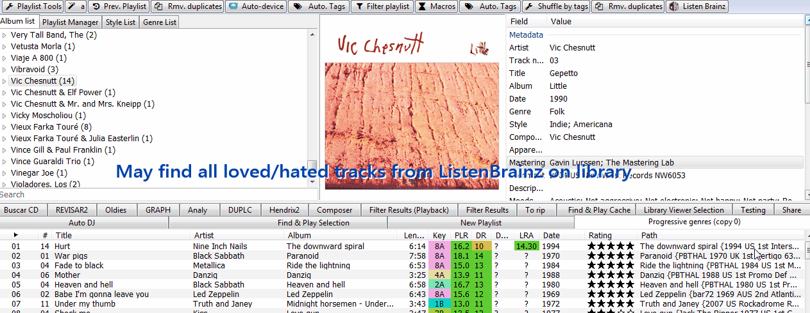

# Listenbrainz

[Download :material-download:](https://github.com/regorxxx/ListenBrainz-SMP){ .md-button }

## Overview

An implementation of [ListenBrainz](https://listenbrainz.org/) for [foobar2000](https://www.foobar2000.org)
 using [Spider Monkey Panel](https://theqwertiest.github.io/foo_spider_monkey_panel),
 which allows to retrieve/set feedback for tracks within foobar2000 library and create
 playlists based on user or site-wide recommendations statistics.

### Features
- Love/Hate tracks. Or clear any feedback set.
- Find loved/hated tracks from server on library. [*]
- Create playlist from Top Listens, either by user or site-wide. [*]
- Create playlist based on user's recommedations: 'Top artist', 'Similar artist', 'Raw recommendations'. [*]
- Non-found tracks on library can be replaced with YouTube links (requires [foo_youtube](https://fy.3dyd.com/download/)).
- Requires an [user token](https://listenbrainz.org/profile/).

[*] Involves content resolution by Artist, Title or Recording MBID. Displays found matches.

!!! warning
	Listens syncing is not managed by this script. It's recommended to use
	[foo_listenbrainz2](https://github.com/phw/foo_listenbrainz2).

### Buttons bar
The button can be loaded within a toolbar or as an independent button. 
It's fully compatible with my other scripts which also use a toolbar (see at bottom), 
so the button can be simply merged with your already existing toolbar panel easily.

!!! question
	Compatible with (toolbar):  
	- [Device Priority](../../scripts/device-priority-smp): Automates foobar2000's output devices.  
    - [Search by Distance](../../scripts/search-by-distance-smp): Creates intelligent "spotify-like"
	playlist using high-level data from tracks and computing their similarity using genres/styles.  
    - [Playlist Tools](../../scripts/playlist-tools-smp): Offers different pre-defefined examples for 
	intelligent playlist creation.  
	- [Last.fm](../../scripts/lastfm-smp): Integrates Last.fm playlists, recommendations, ...  