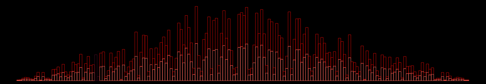
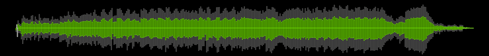

# Not-A-Waveform-Seekbar-SMP

[Download :material-download:](https://github.com/regorxxx/Not-A-Waveform-Seekbar-SMP){ .md-button }

## Overview

A [foobar2000](https://www.foobar2000.org/) UI [Spider Monkey Panel](https://theqwertiest.github.io/foo_spider_monkey_panel/)
 seekbar, using [audiowaveform](https://github.com/bbc/audiowaveform) or [ffprobe](https://ffmpeg.org/ffprobe.html).
 It's based on RMS, peak levels, the actual waveform or visualization presets.

## Features
- Uses [audiowaveform](https://github.com/bbc/audiowaveform) by default (included).
- [ffprobe](https://ffmpeg.org/download.html) can be used if desired. Download it and copy ffprobe.exe into 'helpers-external\ffprobe\'.
- Visualizer mode to simply show an animation which changes according to BPM (if tag exists).
- Fully configurable using the R. Click menu:
	- Colors
	- Waveform modes
	- Analysis modes
	- Animations
	- Refresh rate (not recommended anything below 100 ms except on really modern CPUs)

!!! question
	Integrated in:  
	-  [Georgia ReBORN](https://github.com/TT-ReBORN/Georgia-ReBORN): a Clean, Full Dynamic Color Reborn foobar2000 Theme.