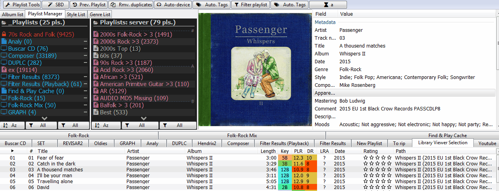

# Playlist-Manager-SMP

[Download :material-download:](https://github.com/regorxxx/Playlist-Manager-SMP){ .md-button }

## Overview

A playlist manager for [foobar2000](https://www.foobar2000.org/) and 
[Spider Monkey Panel](https://theqwertiest.github.io/foo_spider_monkey_panel) /
 [JSplitter](https://foobar2000.ru/forum/viewtopic.php?t=6378) to save and load (auto)playlists on demand,
 synchronizing, ... along many more utilities.

### Features
- Manages Playlist files and AutoPlaylists.
- AutoPlaylists: contains all functionality on Auto-playlist Manager by marc2003 plus more.
- Smart Playlists: contains all functionality found on XBMC or Kodi.
- [ListenBrainz](https://listenbrainz.org/) integration: sync user's playlists, import by 
playlist's MBID; track content resolution by Title, Recording MBID, ....
- Complete documentation, FAQ and step by step guide (see 'readmes\playlist_manager.pdf').
- Loads .m3u8, .m3u and .pls playlists x100 times faster than standard foobar.
- Multiple exporting options: compatible with Foobar2000 mobile, Kodi and XBMC systems, etc.
- Group by categories, tags and inline quick-searching.
- Playlist Tags and actions. Track Auto-tagging.
- Input search box with RegExp and track searching support.
- Filters and Sorting (manually or by multiple algorithms).
- Customizable columns with playlist's metadata.
- Fully configurable UI and shortcuts.
- Fully Wine - Unix - non IE SOs compatible.
- Other scripts integration:
	- [Playlist-Tools-SMP](../../scripts/playlist-tools-smp): Pools may use tracks from playlists files.
    - [ajquery-xxx](../../others/ajquery-xxx): Online controller fully compatible with the manager.
    - SMP Dynamic menus: Playlist actions are also available as main menu
	entries, which allows to bind them to keyboard shortcuts, toolbar buttons
	or executing them using command line.

!!! info
	Full documentation notes can be found at the <a href="https://github.com/regorxxx/Playlist-Manager-SMP/raw/main/readmes/playlist_manager.pdf" target="_blank" class="image fit" type="application/pdf">PDF Manual.</a>
	
!!! warning
	.fpl playlists (native format) are read only and can not be auto-saved since
	the format is closed source and there are no methods on Spider Monkey Panel
	to save them on a path (without showing the 'save as' window), neither load
	them as handle lists.

	Tracking playlists within a network drive requires additional steps to make use
	of the Recycle Bin. See Readme (pdf).