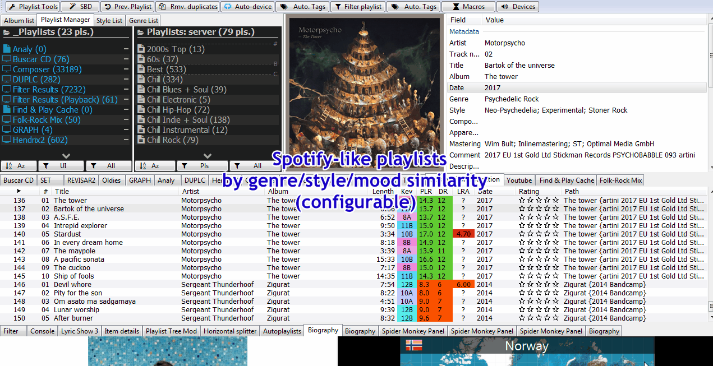

# Playlist Tools

[Download :material-download:](https://github.com/regorxxx/Playlist-Tools-SMP){ .md-button }

## Overview

A collection of [Spider Monkey Panel](https://theqwertiest.github.io/foo_spider_monkey_panel/) 
Scripts for [foobar2000](https://www.foobar2000.org/), built within a menu, which serves as a
 hub for 'usage examples' and shortcuts to the most requested foobar missing functionalities
 : remove duplicates by tags, revive dead items, check errors on tags, spotify-like playlist
 creation, advanced queries, etc.

The collection of scripts provided here are not only a direct replacement of Random Pools or
 MusicIp but an improvement and generalization in many aspects of those tools.
 

 
!!! note
	To use this plugin at its best and to benefit the most from your library, you will want to 
	make sure that your songs have the most possible information on genre, style, key, moods, etc.

- Macros: allows to record and save the menus entries used, as a macro, to be called later.
- Dynamic Queries: queries which adapt to the currently selected track. i.e. 
placeholders tags are substituted with the actual values of the currently selected track.
- Pools: playlist creation similar to Random Pools component.  playlists \ library sources (pools) can be set.
- Fully configurable submenu entries: shift + left click on menu button allows to switch tools functionality.
- User configurable presets: many tools allow you to add your own presets (for ex. Standard Queries) as menu entries.
- Keyboard shortcuts: keyboard shortcuts may be assigned to most of the tools (without requiring panel to be in focus).
- Reduce components loaded with better replacements: Random Pools, Playlist Revive, Best version picker, Database Search, ...
- Online controller integration (ajquery-xxx): online controller fully compatible with most of the offered tools.
- Fully Wine - Unix - non IE SOs compatible.
- Configurable UI and accessibility design: most of the UI is configurable (size, colors, position, draggable buttons).
 All the UI is managed within menus, so it may be used with a narrator (for blindness).

 
!!! question
	Compatible with (toolbar):  
    - [Device Priority](scripts/device-priority-smp): Automates foobar2000's output devices.  
    - [Search by Distance](scripts/search-by-distance-smp): Creates intelligent "spotify-like"
	playlist. Built-in here.  
	- [ListenBrainz](scripts/listenbrainz-smp): Integrates Listenbrainz's feedback and recommendations.  