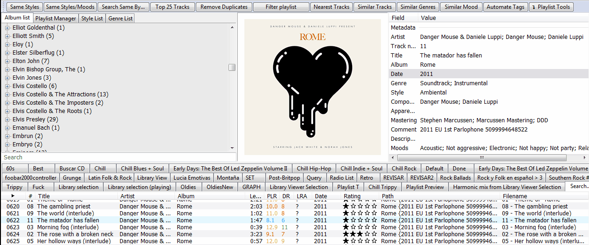

# Search by Distance

[Download :material-download:](https://github.com/regorxxx/Search-by-Distance-SMP){ .md-button }

## Overview

An implementation of [Music-Graph](https://github.com/regorxxx/Music-Graph) 
for [foobar2000](https://www.foobar2000.org/) using 
[Spider Monkey Panel](https://theqwertiest.github.io/foo_spider_monkey_panel/), 
which creates intelligent "spotify-like" playlist using high-level data from tracks 
and computing their similarity using genres/styles.

### Features
Creates playlists using high-level data from tracks similar to the currently selected one 
according to genre, style, key, etc. You can choose whether this final selection is done 
according to score, randomly, using [Harmonic mixing](https://en.wikipedia.org/wiki/Harmonic_mixing)
 rules, etc. All settings are configurable via button's menus (on customizable button) 
 or the properties panel (static buttons). 
 
Some usage examples:
	- Explore similar music from the same era
	- Follow the evolution of a genre during some period
	- Create a playlist transitioning from one genre to another seamleslly
	- Create an harmonic mix which sounds great no matter the genres mixed
	- Just a random playlist with some coherence in its order and tracks

!!! note
	To use this plugin at its best and to benefit the most from your library, you will want to 
	make sure that your songs have the most possible information on genre, style, key, moods, etc.

### Similarity methods

There are 3 methods to calculate similarity between tracks: WEIGHT, GRAPH (see above) and DYNGENRE.

    -WEIGHT: -> Score
    Calculates similarity by scoring according to the tags. Similarity is calculated by simple string
	matching ('Rock' != 'Soul') and ranges for numeric tags. This means some coherence in tags is needed
	to make it work, and the script only works with high level data (tags) which should havebeen added 
	to files previously using manual or automatic methods (like MusicBrainz Picard, see note at bottom).

    -GRAPH: -> Score + Distance
    Apart from scoring, it compares the genre/styles tags set to the ones of the reference track using a
	graph and calculating their minimum mean distance. Imagine Google maps for genre/styles, and looking
	for the distance from Rock to Jazz for ex. Note this is totally different to simple string matching,
	so 'Acid Rock' may be similar to 'Psychedelic Rock' even if they are totally different tag values 
	(or strings). This method is pretty computational intensive.

    -DYNGENRE: -> Score + Simplifed Distance Uses a simplification of the GRAPH method. Let's say we assign
	a number to every "big" cluster of points on the music graph, then we can simply put any genre/style
	point into any of those clusters and give them a value.

### Buttons bar
The buttons can be loaded within a toolbar or as an independent button. 
It's fully compatible with my other scripts which also use a toolbar (see at bottom), 
so the button can be simply merged with your already existing toolbar panel easily.

!!! question
	Compatible with (toolbar):  
    - [Device Priority](../../scripts/device-priority-smp): Automates foobar2000's output devices.  
    - [Playlist Tools](../../scripts/playlist-tools-smp): Offers different pre-defefined examples for 
	intelligent playlist creation.  
	- [ListenBrainz](../../scripts/listenbrainz-smp): Integrates Listenbrainz's feedback and recommendations.  
	- [Last.fm](../../scripts/lastfm-smp): Integrates Last.fm playlists, recommendations, ...  
	- [AutoBackup](../../scripts/autobackup-smp): Automatic backups of configuration files.  
	- [Wrapped](../../scripts/wrapped-smp): User listening statistics and recommendations.  
	- [Fingerprint Tools](../../scripts/fingerprint-tools-smp): ChromaPrint and FooId fingerprinting tools and search.  