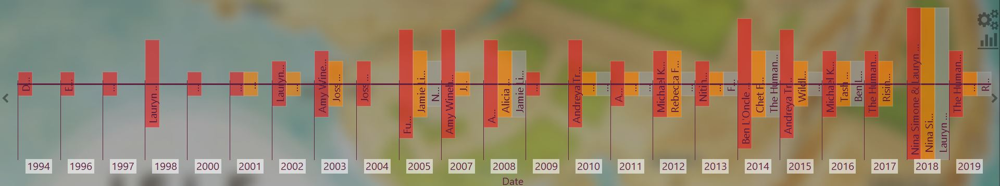
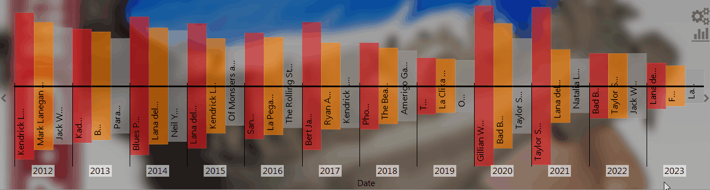

# Timeline-SMP

[Download :material-download:](https://github.com/regorxxx/Timeline-SMP){ .md-button }

## Overview

A [foobar2000](https://www.foobar2000.org/) interactive Timeline 
[Spider Monkey Panel](https://theqwertiest.github.io/foo_spider_monkey_panel/) of your library. 
Configurable by Title Format, lets you generate playlists clicking on it. Based on [Statistics-Framework-SMP](https://regorxxx.github.io/foobar2000-Framework-SMP.github.io/scripts/statistics-framework-smp/)

### Features
- Statistics fully configurable:
	- Set data per axis with [Title Format](https://wiki.hydrogenaud.io/index.php?title=Foobar2000:Title_Formatting_Reference).
	- 3 Axis available.
	- Allows to aggregate data in groups, calculate proportional values per group (for ex. average rating/album), ...
 	- Configurable sources: library, active/now playing playist, selectable playlists (by name).
   	- Filtering with queries.
	- Highly configurable chart and data manipulation.
- Asynchronous data calculations (UI is not blocked).
- Point statistics.
- Scroll with buttons and mouse dragging.
- Zoom with mouse wheel and button.
- Configurable background (cover, colors, gradient, ...).
	- Color palettes and schemes from [colorbrewer](https://colorbrewer2.org).
	- Colorblind friendly.
- Tool-tip shows multiple info about the point selected.
- AutoPlaylist and Playlist creation on click over a point.
- Fully Wine - Unix - non IE SOs compatible.

