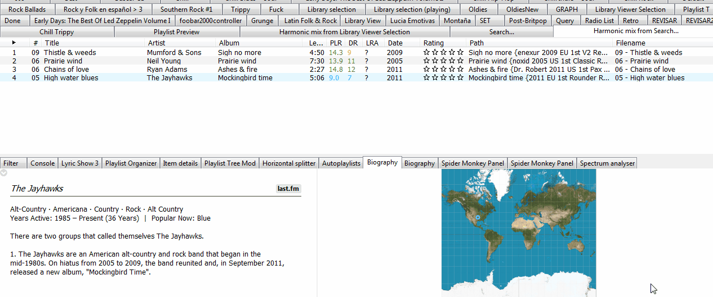

# World Map

[Download :material-download:](https://github.com/regorxxx/World-Map-SMP){ .md-button }

## Overview

A [foobar2000](https://www.foobar2000.org/) UI 
[Spider Monkey Panel](https://theqwertiest.github.io/foo_spider_monkey_panel/) 
which displays current artist's country on the world map and lets you generate 
autoplaylists based on selection and locale tag saving when integrated along
 [WilB's Biography Script](https://github.com/Wil-B/Biography).

 
- Map image configurable:
	- Full.
	- No Antarctica.
	- Custom. (coordinates may need a transformation to work)
- Configurable X and Y factors for transformation (along custom image maps).
- 2 modes:
	- Standard: Follow now playing track or selection.
	- Library: display statistics of entire library (independtly of the selection/playback).
- Works with multiple selected tracks (draws all points on the map), allowing to show statistics of an entire playlist or library.
- Fully configurable UI.
- On playback the panel fetches tags from (by order of preference):
	- Track's tags.
	- JSON database.
	- WilB's Biography panel.
- WilB's Biography integration
- Tool-tip shows multiple info about the points and tracks selected.
- AutoPlaylist creation on click over a point with any artist on your library from the selected country.
- Fully Wine - Unix - non IE SOs compatible.

!!! warning
	Country tags must be previously present on the files, provided by a third party
	script or on a JSON database. 
	
	In case the script will be used in an offline foobar2000 installation, 
	with no Biography script provider, it's recommended to
	tag previously your files and/or use a pre-filled JSON database.  
	One is provided	as example at: 'presets\World Map\worldMap.json'