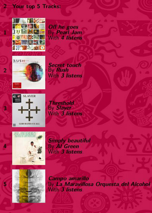
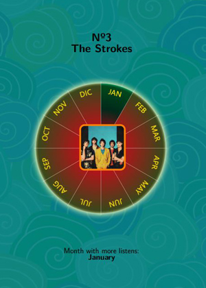
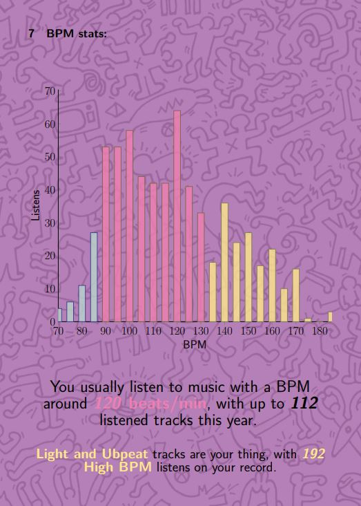

# Wrapped

[Download :material-download:](https://github.com/regorxxx/Wrapped-SMP){ .md-button }

## Overview

User listening statistics for [foobar2000](https://www.foobar2000.org), using [Spider Monkey Panel](https://theqwertiest.github.io/foo_spider_monkey_panel). Analyzes user listening habits and outputs a report similar to Spotify's wrapped and personalized playlists.

{: .center} {: .center}

!!! note
	To use this plugin at its best and to benefit the most from your library, you will want to 
	make sure that your songs have the most possible information on genre, style, key, moods, etc.

### Features
- Computes statistics from the library by:
	* Listening behavior
	* Genres/styles
	* Musical categories (chart)
	* Tracks
	* Listens
	* Artists
	* Regions (if [World-Map-SMP](../../scripts/world-map-smp) is installed)
	* Sound town (if [World-Map-SMP](../../scripts/world-map-smp) is installed)
	* Mood stats (chart)
	* BPM stats (chart)
	* Key stats (chart)
- Outputs a report in Latex format. Compilation in PDF.
- Playlists recommendations: 
	* Top Favourite Songs
	* Discovered Songs (during the year)
	* Top Artists
	* Top Genres
	* Top Countries
	* Suggested Genres (you may like) (ListenBrainz)
	* Suggested Artists (you make like) (ListenBrainz)
- To get statistics for previous years, Enhanced Playback Statistics and Playback Statistics must have been installed on that period.
- Fully Wine - Unix - non IE SOs compatible.
- Configurable UI and accessibility design: most of the UI is configurable (size, colors, position, draggable buttons).
 All the UI is managed within menus, so it may be used with a narrator (for blindness).

{: .center} {: .center}

### Buttons bar
The button can be loaded within a toolbar or as an independent button. 
It's fully compatible with my other scripts which also use a toolbar (see at bottom), 
so the button can be simply merged with your already existing toolbar panel easily.

!!! question
	Compatible with (toolbar):  
    - [Device Priority](../../scripts/device-priority-smp): Automates foobar2000's output devices.  
    - [Search by Distance](../../scripts/search-by-distance-smp): Creates intelligent "spotify-like"
	playlist.  
    - [Playlist Tools](../../scripts/playlist-tools-smp): Offers different pre-defefined examples for 
	intelligent playlist creation.  
	- [ListenBrainz](../../scripts/listenbrainz-smp): Integrates Listenbrainz's feedback and recommendations.  
	- [Last.fm](../../scripts/lastfm-smp): Integrates Last.fm playlists, recommendations, ...  
	- [AutoBackup](../../scripts/autobackup-smp): Automatic backups of configuration files.  
	- [Fingerprint Tools](../../scripts/fingerprint-tools-smp): ChromaPrint and FooId fingerprinting tools and search.  